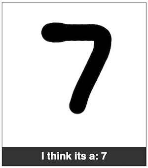

# ml-numbers

A demo that use Tensorflow.js to recognize handwritten numbers in the browser with just javascript. You draw the number a canvas the reat is magic (if it works).

Try the demo 




## Installation

This node.js  project can be installed locally by clone it.

```bash
> git clone https://
> npm i
> npm start
```

## About
